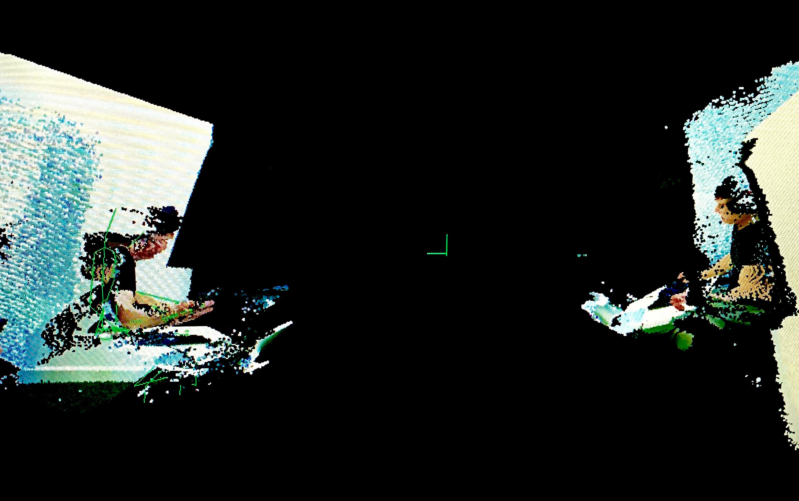

Disseration
===================

Undergraduate disseration project working on the [LiveScan3D](https://github.com/MarekKowalski/LiveScan3D) suite of applications. The project aims to add multisource capabilities and receive multiple streamed locations simultaneously.

This repository includes the mid-year and final report Latex and the associated media. The source repository for the work can be found in the `multisource` branch of [@sarsoo/LiveScan3D](https://github.com/Sarsoo/LiveScan3D).
The mid-year report is available [here](midyear.pdf).

The new layout will look as below with multiple discrete locations streaming to a server which serves a composite view for the user experience.

Additionally the project also aims to include developments for the Hololens and mobile AR experiences. Currently an Android application is under development at [@sarsoo/LiveScan3D-Android](https://github.com/Sarsoo/LiveScan3D-Android).

The project will be concluded by May 2020.